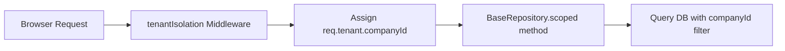

# AI Calling CRM — Automated Calling & Recruitment SaaS Platform
## Master Mentor Presentation, Source Code Walkthrough, and Tech Report

---

## Part 1: Project & Prototype Overview

### 1.1 Executive Summary
**AI Calling CRM** is a cloud-native, multi-tenant recruitment CRM designed to automate high-volume candidate screening using artificial intelligence. Traditionally, recruitment teams spend 70% of their time conducting initial phone screenings. This platform solves that bottleneck by placing automated AI voice screening calls directly to candidates, transcribing their audio responses, grading them, updating the CRM hiring stages, and creating follow-up calendar tasks—all without human recruiter intervention.

### 1.2 System Modules & Screens
The prototype provides nine highly responsive dashboards matching modern minimalist aesthetics:
*   **CRM Dashboard**: Real-time summary metrics (Total Candidates, Active Clients, Completed Calls, Pending Follow-ups) and live dynamic pipelines.
*   **Candidates Database**: Profiles catalog featuring details, skills tags, experience metrics, resume file upload (PDF viewer), and click-to-dial trigger triggers.
*   **Clients Directory**: Corporate account profiles and active hiring criteria records.
*   **Call Logs**: Interactive timeline of outbound dials, duration, audio recording files, transcripts, and AI-generated scoring metrics.
*   **AI Assistant (Screening Analyzer)**: Dedicated playground where recruiters can paste raw conversations, upload audio, and inspect real-time AI classification reviews.
*   **Follow-up Tasks**: Interactive TODO boards with date reminders, custom notes, and automatic trigger status tracking.
*   **Campaign Management**: Group screening tools allowing recruiters to select criteria and schedule bulk automated calling lists.
*   **Performance Analytics**: Multi-series Recharts visuals analyzing call completion volumes, pipeline funnel metrics, success ratios, and recruiter screen-time logs.
*   **Team Settings**: Account workspace where Admins can register new team members (Recruiters or Agents) and toggle account activation.

---

## Part 2: Source Code Walkthrough

### 2.1 Backend Architecture (`/backend`)
The backend is structured under clean **Layered Architecture** principles, enforcing separation of concerns:

```text
backend/src/
├── controllers/          # Receives REST API inputs, directs logic, returns responses
│   ├── auth.controller.js
│   ├── candidate.controller.js
│   └── call.controller.js
├── middleware/           # Security, tenant isolation, and validation layer
│   ├── auth.middleware.js
│   ├── role.middleware.js
│   └── tenant.middleware.js
├── models/               # MongoDB Document Schema structures
│   ├── Candidate.js
│   ├── Call.js
│   └── User.js
├── repositories/         # Direct database connector layer (scoped by company ID)
│   ├── base.repository.js
│   └── candidate.repository.js
├── services/             # Core business logic processing (LLM calling pipeline, billing)
│   ├── call.service.js
│   └── ai/
│       ├── pipeline.js
│       └── decisionEngine.js
└── server.js             # Starts server, setups routes & Socket.io socket server
```

### 2.2 Frontend Architecture (`/frontend`)
The frontend is built on **React (Vite)** and implements state segregation using **Redux Toolkit**:

```text
frontend/src/
├── components/           # Atomic Design components
│   ├── common/           # Custom inputs, tables, custom badges, and modal overlays
│   └── layout/           # Sidebar links and navigation header context
├── redux/                # Global central state store
│   ├── store.js
│   └── slices/           # Auth validation, call logs state, and candidate state
├── routes/               # Path guarding layer
│   └── ProtectedRoute.jsx
├── services/             # Axios connection instances
│   ├── api.js
│   └── candidate.api.js
└── pages/                # High-level screens (Dashboard.jsx, Candidates.jsx, Team.jsx)
```

---

## Part 3: Technical Documentation & Architecture Details

### 3.1 Multi-Tenant Context Isolation
To ensure absolute data security, the platform scopes all databases by `companyId`. Users can only access database entries belonging to their company.
This is implemented in three stages:



1.  **Context Extraction**:
    *   For normal users, [tenant.middleware.js](file:///d:/Projects/RecruAi/backend/src/middleware/tenant.middleware.js) pulls `companyId` from the verified JWT:
        `req.tenant.companyId = req.user.companyId;`
    *   For Super Admins acting on behalf of a company, it reads the header:
        `req.tenant.companyId = req.header("X-Company-Id");`
2.  **Scoping DB Connectors**:
    [base.repository.js](file:///d:/Projects/RecruAi/backend/src/repositories/base.repository.js) automatically wraps Mongoose filters:
    ```javascript
    scoped(companyId, filter) {
      return { ...filter, companyId };
    }
    ```

### 3.2 Secure Document Updates Protection
To solve Mongoose document overrides (which cause data loss when updating single keys), we built an automatic `$set` wrapping interceptor directly in the database repositories:
```javascript
updateById(companyId, id, update, options = { new: true, runValidators: true }) {
  const hasOperator = Object.keys(update).some(k => k.startsWith('$'));
  const finalUpdate = hasOperator ? update : { $set: update };
  return this.model.findOneAndUpdate(this.scoped(companyId, { _id: id }), finalUpdate, options);
}
```

### 3.3 Core REST APIs
| Route Path | Method | Access Level | Description |
| :--- | :--- | :--- | :--- |
| `/api/auth/register` | `POST` | Public | Registers a new company and company admin account. |
| `/api/candidates` | `POST` | Recruiters/Admins | Registers a new candidate profile details. |
| `/api/candidates/:id/resume`| `POST` | Agents/Recruiters | Uploads a candidate resume PDF (Multer storage). |
| `/api/calls` | `POST` | All Users | Initiates Twilio automated call or logs simulation intent. |
| `/api/calls/webhooks/twilio/voice`| `POST` | Public (Twilio) | Returns XML TwiML to Twilio to play script & record response. |
| `/api/calls/webhooks/twilio/recording`| `POST` | Public (Twilio) | Receives candidate recording URL and triggers AI pipeline. |
| `/api/users` | `POST` | Company Admins | Registers a new recruiter or agent teammate profile. |

---

## Part 4: Project Presentation Guide for Mentors

You can utilize this structure for your presentation slides:

*   **Slide 1: Title & Team details**
    *   *AI Calling CRM: Next-gen SaaS Platform for Recruitment Automation.*
*   **Slide 2: The Core Problem**
    *   *Recruiters spend up to 70% of their working hours on manual initial phone screenings. This slows down the hiring cycle and leads to high operational costs.*
*   **Slide 3: Our Solution**
    *   *An automated voice dialer that interviews candidates using AI. Real-time NLP parsing translates speech to transcripts, evaluates candidate suitability, and updates the CRM database dynamically.*
*   **Slide 4: Key Tech Highlights**
    *   *Multi-tenant database isolation, Role-Based Access Control, Twilio Voice automation, dynamic database update protection, and polished dark mode layouts.*
*   **Slide 5: Live Demonstration Script**
    1.  Show the **CRM Dashboard** with active metrics.
    2.  Navigate to **Candidates**, show resume upload, and click the **Call** icon.
    3.  Explain how Twilio places the call, plays the voice script, records candidate speech, and updates call status to `COMPLETED`.
    4.  Navigate to **Calls** to show the saved audio recording, dynamic transcripts, and LLM evaluation parameters.
    5.  Navigate to **Team Settings** and show how Admins can register/suspend Recruiters and Agents.

---

## Part 5: Future Development Ideas

1.  **Real-time WebSocket Voice Conversations**:
    *   Upgrade the calling infrastructure from one-way record/callback to live WebSockets using Twilio Media Streams and **Vapi / Retell AI API**. This allows candidates to hold actual, latency-free conversations with a human-like voice AI recruiter.
2.  **Machine Learning Parsing (AI Resume Matcher)**:
    *   Integrate a PDF parser in the resume upload pipeline to automatically extract skills, contact details, and experience. Recruiters can then sort candidates based on automated match scores against job descriptions.
3.  **Automatic Smart Campaign Scheduling**:
    *   Build a smart task scheduler using Agenda/Cron that schedules calls based on candidates' time zones and auto-schedules subsequent follow-ups.
4.  **Omnichannel Assistant (WhatsApp/SMS Integration)**:
    *   If a candidate does not answer the AI phone call, automatically trigger a WhatsApp message containing a chatbot link to conduct a text-based interview.
