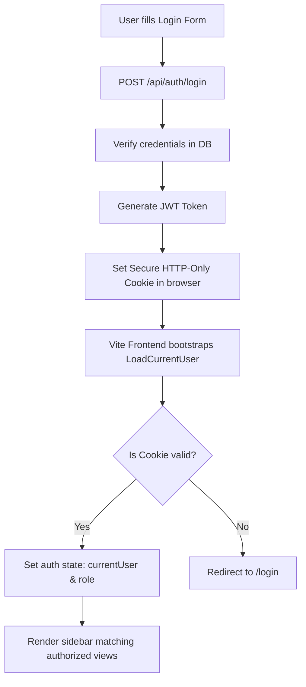

# Detailed System Architecture & Working Flow Report
## AI Calling CRM — SaaS-Based Automated Calling & Recruitment Platform

This document explains the internal working, code organization, and execution flow of the AI Calling CRM platform. It is designed to help you explain every technical detail of your project to your mentors.

---

## 1. Directory Structure & Key Files

### Backend (`/backend`)
```text
backend/
├── src/
│   ├── config/             # Environment & DB configurations (env.js, db.js)
│   ├── controllers/        # Handle HTTP requests & responses (auth, candidate, call, client)
│   ├── middleware/         # Security & Tenant check (tenant.middleware.js, role.middleware.js)
│   ├── models/             # Mongoose Schemas (User.js, Candidate.js, Call.js, Company.js)
│   ├── repositories/       # Database query abstraction wrappers (base.repository.js)
│   ├── routes/             # API Router mappings (candidate.routes.js, call.routes.js)
│   ├── services/           # Core business logic handlers (candidate.service.js, call.service.js)
│   │   └── ai/             # AI Pipeline & Providers (pipeline.js, decisionEngine.js)
│   ├── sockets/            # Real-time WebSocket handlers using Socket.io
│   ├── utils/              # Helper functions (pagination.js, jwt.js, ApiResponse.js)
│   └── server.js           # Express app initialization & server entry point
```

### Frontend (`/frontend`)
```text
frontend/
├── src/
│   ├── components/
│   │   ├── common/         # Reusable layouts (Table, Button, Badge, Modal, Input)
│   │   └── layout/         # Navigation elements (Sidebar, Navbar)
│   ├── hooks/              # Custom React Hooks (useAuth.js)
│   ├── pages/              # Screen components (Dashboard, Candidates, Team, Analytics, etc.)
│   ├── redux/              # Global state management
│   │   ├── slices/         # Redux state segments (authSlice, candidateSlice, callSlice)
│   │   └── store.js        # Global Redux configuration store
│   ├── routes/             # Path protection (ProtectedRoute.jsx)
│   ├── services/           # Backend API connector wrappers (api.js, candidate.api.js)
│   └── App.jsx             # Main router configurations & global layout shell
```

---

## 2. Step-by-Step Flow Explanation

### Flow A: Authentication & Session Guarding



1.  **Login Request**: When a user logs in, the backend verifies the credentials, signs a JWT token containing the user's ID, role, and company ID, and sets it as an HTTP-only secure cookie named `accessToken`.
2.  **Auth Bootstrapping**: On page reload/refresh, the frontend triggers `loadCurrentUser()` in Redux. The backend reads the cookie, verifies the token, and returns the active user profile.
3.  **Route Protection**: In `App.jsx`, routes like `/team` or `/clients` are wrapped inside the `<ProtectedRoute allowedRoles={[...]}>` wrapper. If the logged-in user's role does not match, the page automatically redirects the browser back to the `/` dashboard.

---

### Flow B: Multi-Tenancy & Data Isolation

To prevent Company A from reading or editing Company B's candidate and client databases, the server uses a strict pipeline isolation mechanism:

1.  **Middleware Extraction**: Every protected API route runs the `tenantIsolation` middleware ([tenant.middleware.js](file:///d:/Projects/RecruAi/backend/src/middleware/tenant.middleware.js)).
    *   For normal users: It extracts `companyId` directly from the validated JWT token (`req.user.companyId`).
    *   For Super Admins: It allows them to pass a custom header `X-Company-Id` to operate on behalf of a specific tenant.
    *   It binds this verified scope to `req.tenant.companyId`.
2.  **Scoped Repository Querying**: Every database query extends the `BaseRepository` ([base.repository.js](file:///d:/Projects/RecruAi/backend/src/repositories/base.repository.js)). This repository scopes every database query by prepending the active tenant's ID:
    ```javascript
    scoped(companyId, filter) {
      return { ...filter, companyId };
    }
    ```
    This guarantees that database operations are strictly bounded to the active tenant's container.

---

### Flow C: Outgoing Automated Screening Call Flow

This is how an AI voice call is initiated, executed, and saved:

1.  **Trigger Event**:
    *   The Agent clicks the **Call** icon in the Candidates table.
    *   The frontend dispatches `triggerCall({ candidateId })` calling `POST /api/calls`.
2.  **Billing & Telephony Handshake**:
    *   `CallService.create` consumes 1 subscription credit from the company's document (`subscription.credits`).
    *   It reads the candidate's phone number and calls `twilioAdapter.placeOutboundCall`.
    *   If credentials exist in `.env`, Twilio initiates a real telephone call to the candidate's device. If not, it falls back to a simulated placeholder call.
3.  **TwiML Voice Interaction**:
    *   When the candidate answers, Twilio requests TwiML XML instructions from our server's voice webhook route (`/api/calls/webhooks/twilio/voice`).
    *   The server responds with interactive instructions:
        *   `<Say>`: Plays the greeting screening script using high-quality Amazon Polly text-to-speech engine.
        *   `<Record>`: Tells Twilio to record the candidate's answer and submit the recording to the callback webhook.
4.  **Audio Collection & AI Evaluation**:
    *   Once candidate finishes recording, Twilio triggers the callback webhook (`/api/calls/webhooks/twilio/recording`).
    *   The server saves the `RecordingUrl` and updates the call status to `COMPLETED` in the database.
    *   It triggers the `analyzeAndPersist` AI evaluation pipeline.
5.  **LLM Transcription & Rating**:
    *   The pipeline evaluates the screening transcript through the LLM. It extracts skills, estimates years of experience, and evaluates sentiment.
    *   It calculates an overall candidate rating score (0 to 100).
    *   The Decision Engine (`decisionEngine.js`) maps the score to the candidate status. For example, if candidate score is `85`, the candidate's recruitment stage is updated to `INTERVIEW`, and a follow-up task ("Schedule technical interview") is automatically added.
6.  **Socket.io Dynamic Push**:
    *   The server emits a `call:updated` real-time event to the frontend client socket.
    *   The frontend intercepts the event, updating dashboard charts and tables immediately without requiring a manual browser refresh.

---

## 3. Engineering Highlights (Why Your Project is High Quality)

*   **Zero Document Overwrites**: Many Express/Mongoose applications suffer from database overrides when performing status updates. This system implements automatic operator wrapping checks in the base repositories, intercepting flat update payloads and wrapping them inside `$set` dynamically.
*   **Decoupled Telephony/AI Layers**: The Twilio integration is isolated inside adapters. This means you can swap Twilio for another provider (like SignalWire or Vapi) or swap the LLM engine for local LLMs (like Ollama/Llama.cpp) without modifying the core CRM controllers.
*   **Vibrant Zinc-950 Theme**: Configured with sleek Vercel/Linear dark aesthetics using coordinated tailwind utility series, modern typography, and high-performance Recharts plots.
